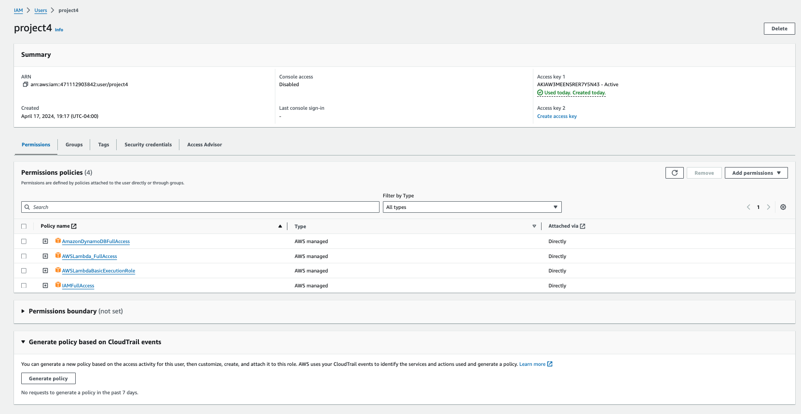

# Mini Project2

In this project, I developed a simple AWS Lambda function that processes text data.
- Rust Lambda Function using Cargo LambdaLinks to an external site.
- Process and transform sample data

## Author

Zairan Xiang

## Rust Lambda Function and Local Test

1. make sure to install rust and cargo lambda

2. ```cargo lambda new projectName```, this command will create a rust project directory for the lambda function

3. Fill in the main.rs file inside the src folder to take a string as ihnput and split the string by white space, then output and show the list of words in that sentence.
```rust
// Import necessary modules
use lambda_runtime::{handler_fn, Context, Error};
use serde::{Deserialize, Serialize};

#[derive(Deserialize, Serialize)]
struct Input {
    result: String, // Input text to be processed (remove punc)
}

#[derive(Deserialize, Serialize)]
struct Output {
    tokens: Vec<String>,
}

#[tokio::main]
async fn main() -> Result<(), Error> {
    let func = handler_fn(process_data); 
    lambda_runtime::run(func).await?; 
    Ok(()) 
}

async fn process_data(event: Input, _ctx: Context) -> Result<Output, Error> {
    let tokens: Vec<String> = event.result.split_whitespace().map(|s| s.to_string()).collect();
    Ok(Output { tokens }) 
}
```

4. Add dependencies inside the Cargo.toml file in the project directory.
```
[dependencies]
lambda_runtime = "0.11.1"
serde = "1"
tokio = { version = "1", features = ["macros"] }

```

4. ```cargo lambda watch``` to compile, keep this terminal open, and

5. open a new terminal in the same directory, do ```cargo lambda invoke --data-file path_to_data_json_file``` to test the functionality of the lambda tokenization function.


## Deploy on AWS

1. Open AWS console, create a new user, add the following permissions to the user.


2. Under Security Sredentials section, generate an access key for API access. Then, set up environment variables so that cargo lambda knows which AWS account and region to deploy to by typing these two lines in the terminal inside each rust project directory:
```
export AWS_ACCESS_KEY_ID="your_access_key_here"
export AWS_SECRET_ACCESS_KEY="your_secret_key_here"
```
3. Build the project by running `cargo lambda build --release`

4. Deploy the project by running `cargo lambda deploy`

Go to AWS Console and navigate to `Lambda`, inside `Function`: If cargo lambda deploy success, you may see the deployed lambda function on AWS, the lambda function should be ready and shown under the list


### Test Lambda Function on AWS
we can also test the functionalities of the lambda function in aws under the Test section:


### Integrate API Gateway:
In the lambda function page, clicl add Trigger and add the API endpoint. We could then find the link right next to a text that says "API endpoint:"

